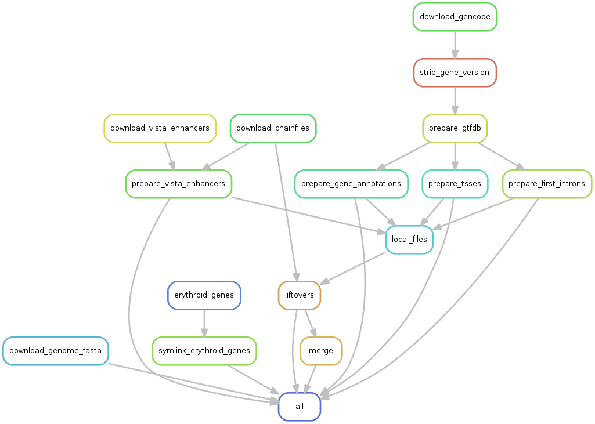
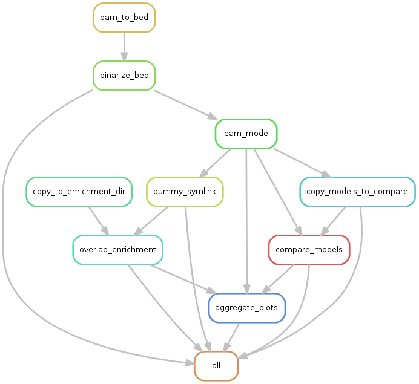

*For the impatient: The file
[`enhancers.bed`](https://github.com/daler/chromhmm-enhancers-umel/raw/master/enhancers.bed)
has the 48041 called enhancers in UMEL cells, which correspond to segments
called as state 3 in the following model:*


## Overview

This repository contains all information and code needed to call enhancers from
histone modification ChIP-seq data in uninduced MEL cells. It boostraps the
installation of requirements, downloads all data needed, and runs multiple
[ChromHMM](http://compbio.mit.edu/ChromHMM/) models in parallel. It can be run
on a high-performance cluster or a laptop, all using the same code.

The analysis uses about 25GB of storage and takes a few hrs to run a machine
with 6 cores and 24GB RAM, using a single set of chromatin marks and from 2 to
12 states. The time will vary depending on internet connection speed and
available hardware.

There are three major stages:

1. Download and prepare data (`prepare_data.snakefile`)

    - downloads BAM, BED, and FASTQ files from ENCODE
    - downloads GTF and FASTA from GENCODE
    - downloads enhancer sequences from VISTA Enhancer Browser; lifts over
      any human enhancers to mouse coordinates
    - downloads from any other configured locations
    - merges replicates as needed
    - lifts over to configured target genome as needed
    - prepares annotation data
    - downloads lists of erythroid genes from Li et al and Hughes et al,
      resolves conflicts and typos in the lists, and creates the union of the
      lists

Here is the DAG of jobs for `prepare_data.snakefile`:



The output of this stage is all configured data downloaded and lifted over to
the target assembly, ready for use by ChromHMM.

2. Run ChromHMM (`chromhmm.snakefile`)

    - build models for multiple configured states
    - build models for multiple configured subsets of data
    - run enrichment over all models
    - compute pairwise comparsions of all models




The output of this stage is multiple ChromHMM models using different sets of
input and different numbers of states.

The helper script `colorize_model.py` can be used to re-label and re-color
segmentations for cleaner presentation.

## Setup

[bioconda](https://bioconda.github.io/) handles all software installation
dependencies.

1. Follow the [bioconda installation instructions](https://bioconda.github.io)
to install conda and enable the bioconda channel.

2. Create two new conda environments. These are isolated environments that are
completely independent of anything you might already have installed on your
machine. The environment names (`chromhmm-enhancers`, `crossmap`) are important
because later code expects those names.

```
conda create -n chromhmm-enhancers --file requirements.txt python=3
conda create -n crossmap crossmap python=2
```

Activate the new `chromhmm-enhancers` environment when following the instructions below:

```
source activate chromhmm-enhancers
```

When you're done, reset back to normal with:

```
source deactivate
```

## Configuration

The main configuration points are the following. If you want to generate
enhancer calls for UMEL cells in the mm9 assembly, you do not need to make any
changes, except perhaps for `CHROMHMM_THREADS` and `MEM_PER_THREAD` in the
`config.yaml` file, since the values of these variables depend on your
available CPU and RAM.

- [`config.yaml`](config.yaml). This file contains lots of documentation to describe exactly
what is configured and how to change it if needed. It is the main point of
configuration.

- [`data.tsv`](data.tsv). The format of this file is described in
`config.yaml`. It defines URLs or local paths from which to acquire data as
well as how they should be labeled.

- [`config` directory](config). This is specifies which datasets are used for
different ChromHMM models. See the `config.yaml` for a description.

## Run

Activate the environment:

```
source activate chromhmm-enhancers
```

Do a dry-run of the `prepare_data.snakefile`:

```
snakemake --dryrun --snakefile prepare_data.snakefile
```

After lots of output, if you have no config errors, you'll see something like
this, reporting how many jobs will be run:

```
Job counts:
        count   jobs
        1       all
        3       download_chainfiles
        1       download_gencode
        1       download_genome_fasta
        1       download_vista_enhancers
        30      liftovers
        30      local_files
        7       merge
        1       prepare_first_introns
        1       prepare_gene_annotations
        1       prepare_gtfdb
        1       prepare_tsses
        1       prepare_vista_enhancers
        1       strip_gene_version
        1       symlink_erythroid_genes
        81
```

Now you can run the workflow, and provide as many cores as you'd like for
parallel processing where possible. Here for example we're running on 6 cores:

```
snakemake --printshellcmds --snakefile prepare_data.snakefile --cores 6
```

After this completes, do the same with the `chromhmm.snakefile` -- do a dry run, and if no errors then run the workflow:

```
snakemake --dryrun --snakefile chromhmm.snakefile
snakemake --printshellcmds --snakefile chromhmm.snakefile --cores 6
```

## Understanding the output

Below is an annotated directory tree after running both files. Files of
particular note are indicated with a `!`.

Configuration files:

```
.
├── requirements.txt                              ! # Programs required for this analysis, installed with conda
├── data.tsv                                      ! # CONFIGURE DATA SOURCES HERE
├── config.yaml                                   ! # Top level config file to be edited by user
├── post-model-config.yaml                        ! # Used to configure which model to use and how to color states
├── config                                          # Subsets for ChromHMM to run are stored here
│   ├── subset1.tsv                               !   # Original file written by user
│   └── subset1.tsv.filled                            # (Version filled in by the workflow, pointing to the lifted-over, converted-to-BED files.)
```

Code and infrastructure files:

```
├── README.md                                     ! # This file
├── prepare_data.snakefile                        ! # Data prep workflow
├── chromhmm.snakefile                            ! # ChromHMM workflow
├── colorize_model.py                               # Colors the segmentation. Used by make_chromhmm_track.sh.
├── helpers.py                                      # Helpful functions
├── viz.py                                          # Used for generating the aggregated plots
```

Important output files:

```
├── models                                          # Output from ChromHMM
│   └── subset1                                       # (Each configured subset has its own subdirectory)
│       ├── 10                                          # (Each configured number of states has its own sub-subdirectory)
│       │   ├── umel_10_segments.bed              !       # BED file of segmentations, labeled by state number
│       │   ├── umel_aggregated_plots.png         !       # Single-figure set of aggregated plots for the model
│       │   ├── emissions_10.png                          # Emissions, critical for interpreting model
│       │   ├── emissions_10.txt                          # Data used for emissions_10.png
│       │   ├── model_comparison_10.png                   # Compares other states in other models
│       │   ├── transitions_10.png                        # Transitions, useful for interpreting model
│       │   ├── umel_enrichment.png                       # Enrichment with files configured in `data.tsv`. Each column's colorscale is scaled independently. Critical for interpreting model
│       │   ├── umel_uniformscale_enrichment.png          # Enrichment with files configured in `data.tsv`. Single colorscale for all.
│       │   └── webpage_10.html                           # Aggregates output for the model

... more models ...

│       ├── 11                                         # 11-state model for subset1
│       │   └── ...                                      # files for 11-state model
│       └── ...
```


Intermediate and data files, mostly for completeness and for understanding the
architecture of the workflows:

```

├── binarized                           # binarized files used by ChromHMM
│   └── subset1                           # (each configured subset has its own subdirectory)
│       ├── umel_chr10_binary.txt           # (there is one file for each chromosome in the subdirectory)
│       ...
│       ...
├── compare_models                  # ChromHMM emissions from all state numbers, used for comparison of states.
│   └── subset1                       # (each configured subset has its own subdirectory)
│       ├── emissions_10.txt          # A copy of `emissions_10.txt` from the models/subset1/10 directory.
│       ├── emissions_11.txt          # ...
│       ...
│       ...
├── data
│   ├── beds_from_bams              # BED files created from lifted-over BAMs, ready for ChromHMM
│   │   ├── umel_control.bed
│   │   ├── umel_dnase.bed
│       ...
│       ...
│   ├── prepare_data_lifted_over    # Mirrors `prepare_data` directory, but data here are have been lifted-over if needed; otherwise symlinked.
│   │   ├── bam
│   │   ├── bed
│   │   ├── bed.gz
│   ├── model_data                  # symlinks to lifted-over BAMs in prepare_data_lifted_over, relabeled and ready for use by ChromHMM
│   │   ├── umel_control.bam
│   │   ...
│   │   ...
│   ├── prepare_data                                 # Staging area where data are downloaded and prepared. Can be from any assembly.
│   │   ├── chainfiles                               # chainfiles downloaded for lifting over to target assemblies
│   │   │   └── ...
│   │   ├── enhancers                                # Preparation of files from the VISTA enhancer browser
│   │   │   └── ...
│   │   ├── gene_annotations                         # Preparation of annotations
│   │   │   ├── first_introns.bed
│   │   │   ├── gencode.vM1.annotation.fixed.gtf     # "chr" added to chroms
│   │   │   ├── gencode.vM1.annotation.fixed.gtf.db  # gffutils database
│   │   │   ├── gencode.vM1.annotation.gtf.gz        # downloaded file (source configured in `config.yaml`)
│   │   │   ├── genes.bed                            # just the genes
│   │   │   ├── intergenic.bed                       # just the intergenic space
│   │   │   └── tsses.bed                            # just the TSSes
│   │   └── mm9
│   │       ├── bam                                  # Downloaded BAM files. URLs configured in `data.tsv`
│   │       │   ├── wgEncodeLicrHistoneMelH3k04me1MImmortalC57bl6StdAlnRep1.bam
│   │       │   └── ...
│   │       ├── bed                                  # Downloaded or symlinked BED files. Configured in `data.tsv`
│   │       │   ├── first_introns.bed
│   │       │   └── ...
│   │       ├── bed.gz                               # Downloaded or symlinked gzipped BED files. URLs configured in `data.tsv`
│   │       │   ├── chd1_umel_encode.bed.gz
│   │       │   └── ...
│   └── symlinked_for_enrich                  # Directory of files to test for enrichment with ChromHMM models. Configured in `data.tsv`.
│       ├── chd1_umel_encode.bed.gz
│       └── ...
├── erythroid-genes                           # Generation of erythroid gene lists from published data
│   ├── data
│   │   ├── hughes-2014
│   │   │   └── GSE47758_Captured_Regions+500bp.bed.gz
│   │   └── li-2013
│   │       └── TableS3.xlsx
│   ├── erythroid-gene-lists.ipynb            # Jupyter notebook to generate the lists
│   └── gene-lists                            # Final gene lists
│       ├── union-ensembl.gene.txt            # (e.g., union of Li and Hughes genes, in Ensembl accession format)
│       └── ...
├── include                                   # Data included in the repository -- mostly because it can't be easily downloaded in script
    ├── MEL_Ldb1_induced.bed                  # LDB1 peaks in IMEL, downloaded from PSU Genome Browser mirror
    └── MEL_Ldb1_uninduced.bed                # LDB1 peaks in UMEL, downloaded from PSU Geneome Browser mirror

```

The easiest way to get a feel for the different state numbers is to go to
a subset's directory and view all the aggregated output images across states.

For example, open these files in an image viewer:

```
models/subset1/*/*aggregated_plots.png
```


## Final output

Decide on a model to use. For example, here 6-state model for `subset1` had
biologically interpretable states that were non-redundant.


Heatmaps are scaled to the max/min values in each panel; for the most part
units are irrelevant as we are looking for qualitative patterns (see [ChromHMM
paper](http://www.nature.com/nmeth/journal/v9/n3/full/nmeth.1906.html) for
details.

- the **emissions** heatmap shows the probability of each mark (columns) in each
state (row).

- the **enrichment** heatmap and **uniform_enrichment** heatmap show the
enrichment of each factor (column) in each state (row). The first heatmap is
column-scaled to identify which state has the maximum enrichment for each
factor. The second heatmap has a uniform scale across the entire matrix, to
look at absolute differences across factors.

* the **transitions** heatmap shows the probability of transitions between states.

* the **comparison** heatmap shows the correlation of the states of this
6-state model (rows) against the most similar state in each of the other states
run in the workflow. For example, state 2 (DNase hypersensitive, enriched with
CTCF and RAD21) is a state that doesn't appear until the 6-state models since
state 2 has low correlation with models with 2-5 states.

For coloring and labeling the states for visualization in a genome browser, run
`python colorize_model.py -h` to check the help for that script. The final
enhancer calls for the 6-state model can be found in
[`enhancers.bed`](https://github.com/daler/chromhmm-enhancers-umel/raw/master/enhancers.bed).
